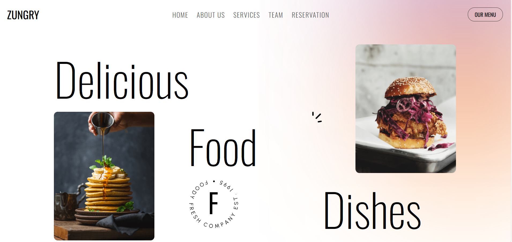
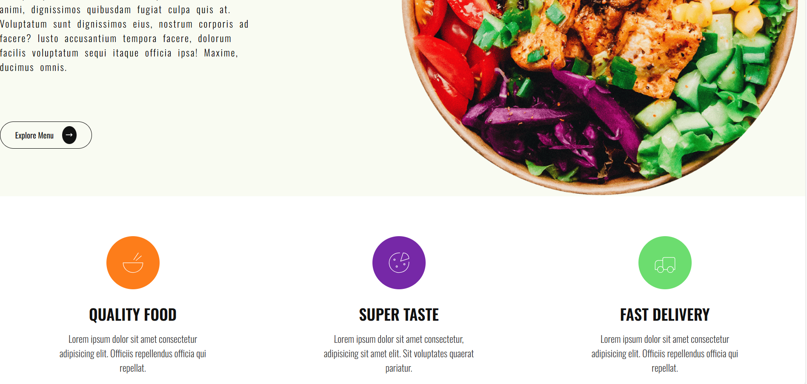
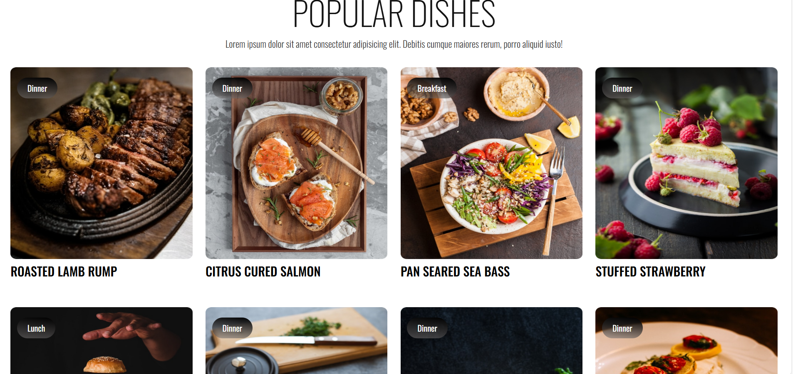
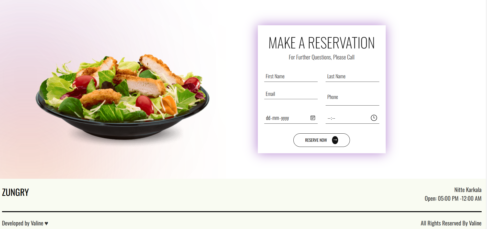

# 🍽️ Restaurant Booking App (React)

A simple and user-friendly **Restaurant Booking Application** built using **React** that allows users to view restaurants and book tables seamlessly. The application focuses on clean UI, smooth user experience, and component-based architecture.

---

##  Tech Stack
- **Frontend:** React.js
- **Styling:** CSS
- **State Management:** React Hooks (`useState`, `useEffect`)
- **Version Control:** Git & GitHub

---

##  Screenshots

###  Home Page

###  Menu Page

###  Dishes 

###  Reservation Booking 

---

